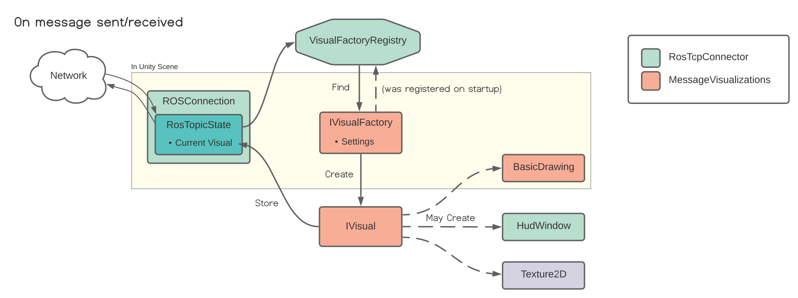
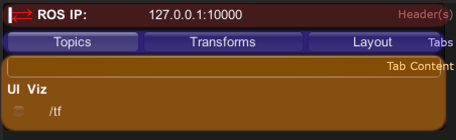

# Message Visualizations design

The goal of this package is to provide a toolkit for users to visualize messages in whatever way suits their needs:
  * We have made visualizations for all the ROS common message types, exposing settings so that users can adjust their color, size, etc; or they can completely replace them with their own visualizations.
  * Users can also make their own visualizations of their custom message types. We've tried to make it easy to call out to our built-in visualizations, because custom messages often contain ROS common messages as elements.

To this end, we provide multiple layers of configurability.

First and foremost, the set of visualizers to use is entirely up to the user: each visualizer is a MonoBehaviour component that lives in the Unity scene. (To get them started, we've made a prefab they can just drag into the scene).
This gives the user a nice obvious workflow for editing visualizer settings (select the relevant component, use the inspector to edit it), and it's also easy to understand how to add, remove, enable or disable visualizers as desired.

# Visualization Flow

This diagram illustrates the important components and their roles in the most common case - visualizing a message that was just sent or received. You can follow along with the code in the [UpdateVisual](https://github.com/Unity-Technologies/ROS-TCP-Connector/blob/91c1dbca71987dab30bea508bdc173a2ecb63d55/com.unity.robotics.ros-tcp-connector/Runtime/TcpConnector/RosTopicState.cs#L161) function if you're interested.

1. The RosTopicState class, which represents everything to do with a specific topic within RosConnection, is notified that a message has been sent or received, and calls out to VisualFactoryRegistry to get the appropriate visualizer (IVisualFactory) for this message.

2. Once a visualizer has been obtained, we have it create an IVisual for the given message.

3. Recycle the old IVisual (not shown in the diagram, for simplicity) - give the new IVisual the opportunity to reuse data and components from the old one. (This step is done for efficiency. What this means in practice is that it [steals the existing BasicDrawing and clears its contents](https://github.com/Unity-Technologies/ROS-TCP-Connector/blob/375209334c1dcda093ed22e0bffbadcf81f22cff/com.unity.robotics.message-visualizations/Runtime/Scripts/DrawingVisual.cs#L75). This optimization significantly reduces the amount of garbage collection we have to do.)

3. The visual creates whatever graphical, hud or other elements are necessary.

4. The visual is stored in the RosTopicState so that it can be cleaned up/recycled later when a new message is received, or hidden if the user turns off this visualization.

# VisualFactoryRegistry

https://github.com/Unity-Technologies/ROS-TCP-Connector/blob/laurie/HudRefactor/com.unity.robotics.ros-tcp-connector/Runtime/MessageVisualization/VisualFactoryRegistry.cs
- This static class keeps track of what visualizers exist, and will pick a suitable visualizer for a given topic and message.
- Each visualizer is expected to register itself with the VisualFactoryRegistry at startup.
- There are two different ways to register a visualizer - by message type, or by topic.
    - Registering by topic takes priority: it means that your visualizer is responsible for all messages sent or received on that topic.
	- Registering by message type means that your visualizer will handle all messages of that type that don't have a specific topic visualizer.
- All our default visualizers have a "topic" field; if you provide one, they will register themselves by topic. If you leave it blank, they will register by message type.
- In addition to the topic/type separation, visualizers are registered with a "priority" value. All the default visualizers we have in the prefab are set to low priority, so we will use any default-priority visualizer in the scene.

# IVisualFactory vs IVisual

- Each visualizer implements the IVisualFactory interface. This is the type that gets registered in the VisualFactoryRegistry. IVisualFactory is responsible for creating IVisuals (as the name implies).
- The main function in IVisualFactory is `IVisual CreateVisual(Message message, MessageMetadata meta)`. As that function signature implies, each IVisual represents the visualization of one specific message.
- There can be many IVisuals active at once. The key idea here is that a single visualizer doesn't just show one visualization at a time. For example, maybe we have only one visualizer for Point messages, but it might be required to draw multiple points - when there are Point messages being sent on multiple topics for example.

We don't make any assumptions about what a visualization needs to do (user-defined visualizations just run arbitrary code within the Unity scene, so they can really do whatever the user wants - spawn prefabs, move objects around, play audio... whatever works), but we do provide some useful components;

# HudPanel and HudWindows

https://github.com/Unity-Technologies/ROS-TCP-Connector/blob/laurie/HudRefactor/com.unity.robotics.ros-tcp-connector/Runtime/TcpConnector/HUDPanel.cs
- For visualizing 2d or text based data, we offer a simple GUI system. A visualizer can open a window to show whatever information is relevant.
- The hud will attempt to automatically lay out these windows for you; or the user can manually drag and resize them. The layout can be saved and exported to a file.
- The hud is also designed to be user customizable; Users can also add their own tabs to the tab bar, or add new headers to the header area.

# BasicDrawing
https://github.com/Unity-Technologies/ROS-TCP-Connector/blob/laurie/HudRefactor/com.unity.robotics.message-visualizations/Runtime/BasicDrawing/Scripts/BasicDrawing.cs
- BasicDrawing (name might need to change) is an easy to use, high performance 3d drawing component. It works well with visualizations but is perfectly functional on its own; users can use it for whatever purpose they want.
- It offers functions for drawing 3d points, lines, text labels in 3d space, simple shapes (cube, sphere, cone), textured squares, arbitrary meshes and point clouds.
- Each point in a point cloud is a billboarded quad. The billboarding is done in a shader on the GPU side, so the performance is extremely good; in tests on my laptop I was able to move around and view a static point cloud of 10 million points at an acceptable framerate. (Moving points would be a different story).

# MessageVisualizations class

https://github.com/Unity-Technologies/ROS-TCP-Connector/blob/laurie/HudRefactor/com.unity.robotics.message-visualizations/Runtime/Scripts/MessageVisualizations.cs
- Separate from the components I've described so far, here is another important piece of the puzzle: The MessageVisualizations static class is a library of extension methods for drawing visualizations of specific messages.
- In fact, almost all of our code for drawing messages is in this class. As far as possible none of our visualizer classes actually do any work. ([Here's a good example](https://github.com/Unity-Technologies/ROS-TCP-Connector/blob/laurie/HudRefactor/com.unity.robotics.message-visualizations/Runtime/DefaultVisualizers/Geometry/DefaultVisualizerVector3.cs)). They just define a few settings, and then forward those settings to the appropriate MessageVisualization function to do the actual drawing work.
- The goal is for MessageVisualizations to be a library of useful visualization functions for users to build into their own visualizations.
